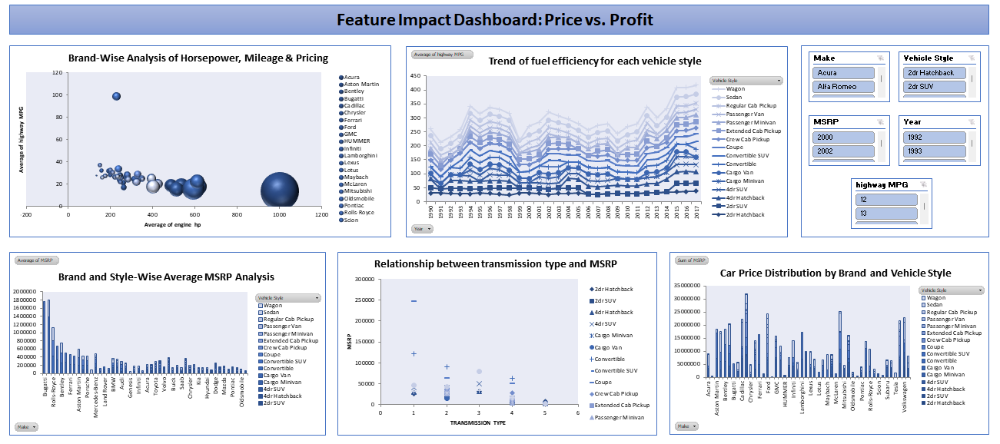

# Analyzing the Impact of Car Features on Price and Profitability

## Overview
This project explores the relationship between car features and their impact on price and profitability. With evolving market trends and rising demand for energy-efficient vehicles, understanding how features influence consumer preferences and pricing is critical for automobile manufacturers. The dataset used in this project provides insights into more than 11,000 car models and allows for comprehensive analysis and dashboard creation using Excel.

## Problem Statement
**How can a car manufacturer optimize pricing and product development decisions to maximize profitability while meeting consumer demand?**

The objective is to identify the key features and categories that are both popular with consumers and profitable for the manufacturer using data analysis techniques such as regression analysis, pivot tables, and data visualization.

---

## Dataset Overview

Key Variables:
- Make / Model / Year – Car identification

- Engine Fuel Type / HP / Cylinders – Engine specifications

- Transmission Type / Driven Wheels – Performance & handling

- Doors / Vehicle Size / Style – Physical attributes

- Market Category / Popularity – Consumer & marketing insights

- City MPG / Highway MPG – Fuel efficiency

- MSRP – Manufacturer’s Suggested Retail Price
---

## Skills & Tools Used
- **Excel Functions:** AVERAGE, SUMIF, AVERAGEIF, AVERAGEIFS, COUNTIF, CORREL, TRENDLINE
- **Data Cleaning Techniques:** Handling missing values, outlier detection and removal
- **Pivot Tables & Charts**
- **Regression Analysis**
- **Interactive Dashboards**

---

## Project Workflow
### 1. Data Understanding & Cleaning
- Remove missing values or replace them appropriately.
- Detect and handle outliers.
- Convert or group columns where necessary (e.g., fuel types).

### 2. Exploratory Data Analysis (EDA)
Gain insights through visualizations and statistical summaries.

---

## Data Analytics Tasks

### Task 1: Market Category Popularity
- **1.A:** Pivot table showing car models by market category and popularity scores.
- **1.B:** Combo chart visualizing the relationship between market category and popularity.

### Task 2: Engine Power vs Price
- **Insight:** Relationship between engine HP and MSRP.
- **Method:** Scatter plot with a trendline.

### Task 3: Key Price Determinants
- **Insight:** Most important features influencing MSRP.
- **Method:** Regression analysis + bar chart for variable coefficients.

### Task 4: Manufacturer Price Comparison
- **4.A:** Pivot table showing average MSRP by manufacturer.
- **4.B:** Bar chart comparing manufacturers.

### Task 5: Fuel Efficiency vs Cylinders
- **5.A:** Scatter plot (x = cylinders, y = highway MPG) + trendline.
- **5.B:** Calculate correlation coefficient.

---

## Interactive Dashboard
Build an interactive Excel dashboard with slicers and filters.

### Dashboard Tasks

#### Task 1: Price Distribution by Brand & Style
- **Chart Type:** Stacked column chart
- **Insight:** Total MSRP by brand and body style

#### Task 2: Average MSRP Comparison
- **Chart Type:** Clustered column chart
- **Insight:** Highest and lowest average MSRPs by brand and body style

#### Task 3: Transmission Type & Price
- **Chart Type:** Scatter plot
- **Insight:** Effect of transmission type on MSRP, by body style

#### Task 4: MPG by Body Style and Model Year
- **Chart Type:** Line chart
- **Insight:** Trend of fuel efficiency by body style across years

#### Task 5: Horsepower, MPG, Price by Brand
- **Chart Type:** Bubble chart
- **Insight:** Brand-wise comparison using average horsepower, MPG, and MSRP

---

##  Dashboard Preview



---

## Repository Structure
```
Analyzing-the-Impact-of-Car-Features-on-Price-and-Profitability/
├── Dataset/
│   └── car_features_and_msrp.csv
├── Excel_Dashboard/
│   ├── Car_Analysis_Dashboard.xlsx
│   └── Charts_and_Pivots.xlsx
├── Screenshots/
│   └── dashboard_preview.png
├── README.md
└── Project_Report.pdf
```

---

## Conclusion
This project helps car manufacturers identify the most profitable and in-demand vehicle features by analyzing real-world data. By developing a comprehensive dashboard and performing targeted analysis, valuable business insights are drawn to guide pricing strategies and product development decisions.

---


